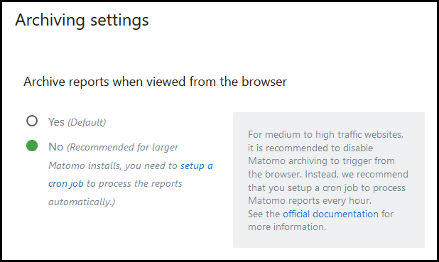

<p align="center"><a href="https://github.com/crazy-max/docker-matomo" target="_blank"></a></p>

<p align="center">
  <a href="https://microbadger.com/images/crazymax/matomo"></a>
  <a href="https://travis-ci.org/crazy-max/docker-matomo"></a>
  <a href="https://hub.docker.com/r/crazymax/matomo/"></a>
  <a href="https://hub.docker.com/r/crazymax/matomo/"></a>
  <a href="https://saythanks.io/to/crazymax"></a>
  <a href="https://www.paypal.com/cgi-bin/webscr?cmd=_s-xclick&hosted_button_id=JP85E7WHT33FL"></a>
</p>

## About

[Matomo](https://matomo.org/) (formerly Piwik) Docker image based on Alpine Linux and Nginx.<br />
If you are interested, [check out](https://github.com/search?utf8=%E2%9C%93&q=docker++user%3Acrazy-max&type=Repositories) my other 🐳 Docker images!

## Features

### Included

* GeoLite data created by [MaxMind](http://www.maxmind.com) for geolocation.
* Cron to archive Matomo reports and update GeoLite data.
* [SSMTP](https://github.com/alterrebe/docker-mail-relay) for SMTP relay to send emails.

### From docker-compose

* Reverse proxy with [nginx-proxy](https://github.com/jwilder/nginx-proxy)
* Creation/renewal of Let's Encrypt certificates automatically with [letsencrypt-nginx-proxy-companion](https://github.com/JrCs/docker-letsencrypt-nginx-proxy-companion)
* [Redis](https://github.com/docker-library/redis) image ready to use with [RedisCache](https://matomo.org/faq/how-to/faq_20511/) or [QueuedTracking plugin](https://matomo.org/faq/how-to/faq_19738) for better scalability.

## Docker

### Environment variables

* `TZ` : The timezone assigned to the container (default to `UTC`)
* `SITE_URL` : Your Matomo site URL
* `CRON_GEOIP` : Periodically update GeoIP data (default to `0 2 * * *`)
* `CRON_ARCHIVE` : Periodically execute Matomo [archive](https://matomo.org/docs/setup-auto-archiving/#linuxunix-how-to-set-up-a-crontab-to-automatically-archive-the-reports) (default to `*/15 * * * *`)
* `LOG_LEVEL` : [Log level](https://matomo.org/faq/troubleshooting/faq_115/) of Matomo UI (default to `WARN`)
* `MEMORY_LIMIT` : PHP memory limit (default to `256M`)
* `UPLOAD_MAX_SIZE` : Upload max size (default to `16M`)
* `OPCACHE_MEM_SIZE` : PHP OpCache memory consumption (default to `128M`)
* `SSMTP_HOST` : SMTP server host
* `SSMTP_PORT` : SMTP server port (default to `25`)
* `SSMTP_HOSTNAME` : Full hostname (default to `$(hostname -f)`)
* `SSMTP_USER` : SMTP username
* `SSMTP_PASSWORD` : SMTP password
* `SSMTP_TLS` : SSL/TLS (default to `NO`)

### Volumes

* `/var/www/config` : Matomo config folder
* `/var/www/misc/user` : Directory to store the [custom logo](https://matomo.org/faq/new-to-piwik/faq_129/) for Matomo
* `/var/www/plugins` : Matomo plugins folder if you want to add custom plugins

### Ports

* `80` : HTTP port

## Usage

Download the [docker-compose.yml](docker-compose.yml) template and the [env](env) folder in the same directory.<br />
Edit those files with your preferences, then run :

```bash
docker-compose up -d
docker-compose logs -f
```

## Configuration

### Disable Matomo archiving from browser

As this image automatically archive the reports, you have to disable Matomo archiving to trigger from the browser. Go to **System > General settings** :



### Change location provider

As GeoIP module for Nginx is installed and uses GeoIP data, you have to select **GeoIP (HTTP Server Module)** in **System > Geolocation** :


### Behind a reverse proxy ?

If you are running Matomo [behind a reverse proxy](https://matomo.org/faq/how-to-install/faq_98/), add this to your config.ini.php :

```
[General]
assume_secure_protocol = 1 # 0=http 1=https
proxy_client_headers[] = HTTP_X_FORWARDED_FOR
proxy_client_headers[] = HTTP_X_REAL_IP
proxy_host_headers[] = HTTP_X_FORWARDED_HOST
```

### Redis cache

To use [Redis as a cache](https://matomo.org/faq/how-to/faq_20511/) (useful if your Matomo environment consists of multiple servers), add this to your config.ini.php :

```
[Cache]
backend = chained

[ChainedCache]
backends[] = array
backends[] = redis

[RedisCache]
host = "redis" # Docker service name for Redis 
port = 6379
timeout = 0.0
password = ""
database = 14
```

In case you are using queued tracking: Make sure to configure a different database! Otherwise queued requests will be flushed.

## Update

```bash
docker-compose pull
docker-compose up -d
docker-compose exec --user nginx php console core:update
```

## How can i help ?

We welcome all kinds of contributions :raised_hands:!<br />
The most basic way to show your support is to star :star2: the project, or to raise issues :speech_balloon:<br />
Any funds donated will be used to help further development on this project! :gift_heart:

[](https://www.paypal.com/cgi-bin/webscr?cmd=_s-xclick&hosted_button_id=JP85E7WHT33FL)

## My Docker images

* [docker-artifactory](https://github.com/crazy-max/docker-artifactory) : JFrog Artifactory Docker images
* [docker-dokuwiki](https://github.com/crazy-max/docker-dokuwiki) : DokuWiki Docker image based on Alpine Linux and Nginx
* [docker-firefox-syncserver](https://github.com/crazy-max/docker-firefox-syncserver) : Firefox Sync Server Docker image
* [docker-nextcloud](https://github.com/crazy-max/docker-nextcloud) : Nextcloud Docker image based on Nextcloud image with advanced features
* [docker-rtorrent](https://github.com/crazy-max/docker-rtorrent) : rTorrent Docker image based on Alpine
* [docker-svn2git-mirror](https://github.com/crazy-max/docker-svn2git-mirror) : Docker image to mirror SVN repositories to Git periodically

## License

MIT. See `LICENSE` for more details.
